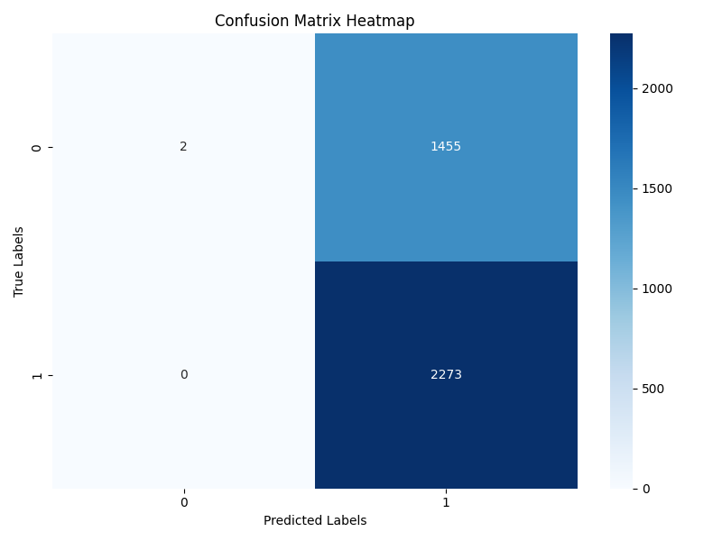

Email Phishing Detector
This project is a machine learning-based Email Phishing Detector built using Python. It uses a dataset of emails to train a model that classifies whether an email is phishing or legitimate.

 Dataset
Path: C:\Users\sagni\Downloads\Email Phising Detector\Phishing_Email.csv

Expected Columns: The dataset must contain numerical/categorical features with a label column (label) indicating whether the email is phishing (1) or legitimate (0).

 Model
Type: Feedforward Neural Network (Sequential Model)

Framework: TensorFlow / Keras

Saving Formats:

.h5 – Keras model

.yaml – Model architecture

.pkl – Scikit-learn label encoder for reusability

 Project Structure
bash
Copy
Edit
Email Phising Detector/
├── Phishing_Email.csv
├── email_phishing_model.h5        # Trained model
├── model_architecture.yaml        # Model architecture
├── label_encoder.pkl              # Saved LabelEncoder
├── phishing_detector.py           # Main training and saving script
├── accuracy_heatmap.py            # Evaluation & visualization
└── README.md
 How to Run
Install Dependencies

bash
Copy
Edit
pip install pandas numpy scikit-learn matplotlib seaborn tensorflow
Train the Model & Save Files

bash
Copy
Edit
python phishing_detector.py
This will:

Train a neural network on your dataset.

Save model (.h5), architecture (.yaml), and label encoder (.pkl) in the project directory.

Evaluate the Model

bash
Copy
Edit
python accuracy_heatmap.py
This will:

Load the saved model and label encoder.

Display classification accuracy.

Show a confusion matrix heatmap.

 Outputs
 Accuracy Score
Displays the test accuracy of the trained model.

 Confusion Matrix Heatmap
 

Shows how well the model performs on each class (phishing vs legitimate).

🔒 Author
Sagnik Patra
M.Tech | IIIT Trichy
